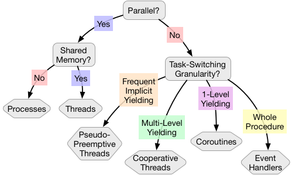

# Software Primitives for Multitasking

## Abstract

Most introductory programming courses focus on _procedural_ software.
Procedural software has a single task: it starts, reads some input, does
some work, produces some output, then finishes.  In contrast, the vast
majority of software we use on a daily basis is interactive.
Interactive software reacts to user input, communicates with other
machines over the network, controls hardware devices, etc.  Interactive
software is also called multitasking software; it has to keep multiple
balls in the air at the same time.

Modern mainstream software is substantially more interactive than its
forbears.  Even as recently as 10 years ago it was much more common to
see applications that ran entirely locally and used simple
keyboard-and-mouse UI.  This change can mostly be chalked up to the rise
of the internet as a software platform and mobile devices with rich user
interfaces.  A lot of smart money is on this trend continuing for the
foreseeable future.  Existing frameworks for multitasking (most
commonly event handlers and threads) have serious weaknesses that have
become painful to software developers.

In this talk we will survey and critique existing primitives for
interactivity.  Then we will look at a new alternative:
pseudo-preemptive threads (a.k.a. activities).

[Short version]

Most introductory programming courses focus on software that does one
task: get input, compute, produce output, done.  But most of the
software we use is multitasking (also called reactive or interactive).
Surprisingly, the software engineering community is not yet settled on
what the "right" framework for building multitasking software is.  In
this talk we will survey and critique the existing options and introduce
a new alternative: pseudo-preemptive threads (a.k.a. activities).

[tiny.cc/ff_multitasking_notes](tiny.cc/ff_multitasking_notes)

## Outline:

- Background
  - Multitasking/Interactive Software
  - Examples
  - Jargon: Concurrency, Parallelism, Multitasking/Interactivity
  - No "Right" Way to Structure Multitasking Software
- Survey and Critique
  - Event handling
  - Threads
  - Processes
  - Coroutines
  - Cooperative threads
  - Functional reactive programming
- Pseudo-Preemptive Threads (Activities)

## Background

### Multitasking/interactive software def'n:

Software that _gives the appearance_ of performing multiple tasks
simultaneously.  (Being ready to react quickly to an event like a mouse
click counts as "performing a task".)

### Examples of interactive software:

| Less Interactive                                       | More Interactive  |
|--------------------------------------------------------|-------------------|
| LaTeX | Word              |
| Matlab                                                 | Excel             |
| Adventure                                              | World of Warcraft |
| batch                                                  | incremental       |

(A common model at the user interface layer: a single "foreground" task
and any number of "background" tasks.)

Historical perspective: Three eras of interactivity in (mainstream)
computing.

- -&infin; &rarr; ~1980: __Mainstream software sequential; early
  multitasking research__.  The first substantial interactive software
  demonstration was Ivan Sutherland's Sketchpad in the mid-1960s.  Most
  mainstream software was still very batch/command line.  One of the
  most forward-looking demonstrations of interactive software was
  Douglas Engelbart's "[mother of all
  demos](https://www.youtube.com/watch?v=yJDv-zdhzMY)". (1:15:30)

- ~1980 &rarr; ~2005: __Desktop__.  Starting with the Macintosh and
  Amiga in the 1980s interactive desktop applications became mainstream.
  Interactivity existed in lots of apps, but was of modest complexity.
  Keyboard-and-mouse UI; limited network interaction.

- ~2005 &rarr; ???: __Web and mobile__.  Examples: iPhone 2007 Google
  Docs 2006.  In the mid-aughts our current era began.  It's
  characterized by applications that have rich network interactions
  built in from the very beginning.  And devices that have many
  interaction modalities (video, audio, touch, wireless networks, GPS,
  haptic, ...).

### Multitasking/Interactivity vs Parallelism vs Concurrency

Another way to say interactivity: _virtual simultaneity_.  "Virtual"
because for the purposes of interactivity it does not matter whether any
of the tasks are ever physically executing simultaneously.  Computers
can switch between tasks at the microsecond granularity.  This is way
beyond sufficient for giving humans the illusion of simultaneity.

_physical simultaneity_ (a.k.a. parallelism) is using multiple
processors to make a single task go faster.  I'm not going to talk about
parallelism today.  Brief side note on terminology (warning: a lot of
this jargon is used inconsistently by different people): Interactivity
and parallelism together make up concurrency.  A pet peeve of mine is
people muddling concurrency, parallelism and interactivity together.

### No "Right" Way to do Interactivity (Yet)

A surprising fact: Interactivity is important and has existed for a long
time (relative to computing as a field), yet we still do not have
programming language-level frameworks for interactive software that are
generally considered "right" by software engineers and researchers.
Contrast this with primitives for non-interactive (i.e. sequential)
software:

| Primitive           | Description                                         |
|---------------------|-----------------------------------------------------|
| [Sequencing](http://media02.hongkiat.com/action-sequence-photography/Snowboard-Sequence-Photography.jpg)          | "Do action X, then action Y"                        |
| [Decisions](http://svprojectmanagement.com/wp-content/uploads/Taming_Email_Decision_Tree.jpg)           | "Do action X or action Y, depending on condition Z" |
| [Loops and recursion](http://creativegibberishcom.ipage.com/wpfiles/wp-content/uploads/2011/08/creative-repetition-andy-monroe.jpg) | "Repeat action X until condition Y"                 |
| [Procedure calling](?)   | "Do a bunch of stuff, then come back here"          |
| [Exception handling](?)  | "Try action X, but if it fails do Y"                |

## Survey and Critique

All the code for this presentation can be found
[HERE](../Testing/MicroTests/MultiDns).

### Event Handlers

Event handling. (~All GUI frameworks; esp. JavaScript)

- Strength: Simple.  Great for basic interaction patterns.
- Weakness: Starvation; "callback hell".

### (Preemptive) Threads

 Threads. (~All systems; interestingly not JavaScript)

- Strength: Write each task using non-interactive control flow.
- Weakness: Concurrency bugs galore (races, deadlocks, etc.).

### Interlude #1: The Desktop Era Consensus

First claim: In the desktop era event handlers (and a couple threads)
was a good enough model.  In the web-and-mobile era the consensus around
that model is eroding and we have seen renewed interest in coroutines.
But coroutines are no panacea.  I am working on a new framework called
"pseudo-preemptive threads" (or "activities" for people who prefer fewer
syllables).

### Processes

Conceptually processes are very similar to threads.  The only difference
(which happens to have profound consequences) is that all the threads in
an application can access the same memory, whereas processes all have
their own memory space.

- Strength: Strong concurrency bug resistance.
- Weakness: No shared state!!!

In practice processes are not a very good primitive for implementing
tasks in interactive applications.

Interesting tangent: "web workers" are a new and evolving part of the
web browser programming ecosystem.  Many authors compare them to
threads, but they're really much more like processes.

### Coroutines

Recent implementations:

- .NET async/await
- JavaScript generators

Coroutines are kind of like threads, except only one coroutine can run
at a time.  Switching from one coroutine to another happens explicitly
with yield/wait invocations.  The weirdest feature of coroutine
frameworks is that the programmer has to explicitly partition methods
into regular methods and coroutines.  Yield/wait can only be invoked
from coroutines, not regular methods.

- Strength: A sliver of threads' natural control flow.
- Weakness: Same as event handlers; just pushed back a bit.

### Cooperative Threads

Syntactically cooperative threading implementations usually look very
much like regular (preemptive) threads.  However, they behave more like
coroutines.  Like coroutines, the active cooperative thread cannot be
interrupted except by explicitly yielding control.  Unlike coroutines,
any procedure is allowed to invoke yield/wait.

The primary weakness of cooperative threads is a bit subtle but hugely
consequential.  The placement of yield invocations has a big impact on
the behavior of the program.  If a program runs too long without
invoking yield it might become unresponsive.  On the other hand if a
procedure invokes yield when its caller isn't expecting it, that might
cause concurrency bugs by violating atomicity assumptions.

The result of this trickiness about yield placement is that applications
become very brittle.  It's hard to add or remove yields.

- Strength: Programming style more like threads than coroutines.
- Weakness: Where should the yields go???

### Functional Reactive Programming

This one is so different from all the rest that it doesn't even fit into
the same categorization scheme.  A common theme of all the other
frameworks: _in response to event E, run code C_.  In FRP the whole
application is a function (a real mathematical function) from the state
of all the inputs that the program cares about to the state of all the
outputs that the program controls.

- Strength: Solid formal model.
- Weakness: Hard open practical questions; still a research topic.

## Pseudo-Preemptive Threads (Activities)

Activities are my own invention.  They are a very early-stage research
project.  They are are non-parallel framework that is yet closer to
regular threads.  Activities are like cooperative threads, but the
language implementation implicitly inserts yields in every loop in the
program.

Doesn't frequent implicit yielding imply exactly the same problems that
threads.  No!

- There are no data races with activities.
- Any block of code can easily be made atomic with unyielding.
